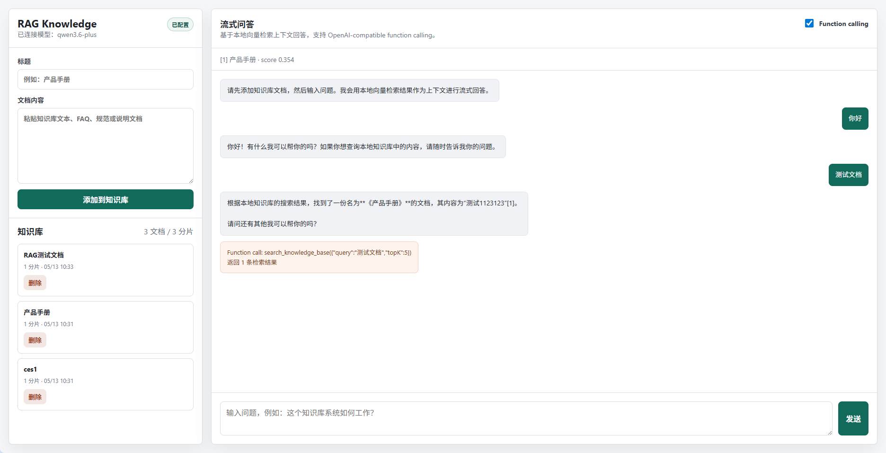

# RAG Knowledge



一个零依赖 Node.js RAG（检索增强生成）向量知识库，包含完整的文档管理、本地向量检索和流式问答功能。纯原生 Node.js 实现，无需任何第三方 npm 包。

## 特性

- **零依赖**：仅使用 Node.js 内置模块，`npm install` 不需要安装任何包
- **文档入库**：通过 API 添加/删除文档，自动分片和向量化
- **本地向量检索**：基于 TF cosine similarity 的轻量级向量检索
- **LLM 集成**：兼容任何 OpenAI `/chat/completions` 协议的服务（OpenAI、DashScope、私有部署等）
- **SSE 流式输出**：Server-Sent Events 实时推送回答内容
- **Function Calling**：支持 `search_knowledge_base` 工具调用，自动进行二次检索
- **前端界面**：内置知识库管理和聊天 UI

## 架构

```
┌─────────────┐    ┌──────────────┐    ┌─────────────┐
│   前端 UI    │───>│  server.js   │───>│   LLM API    │
│  (原生 HTML) │<───│  (原生 HTTP) │<───│ (OpenAI兼容) │
└─────────────┘    └──────┬───────┘    └─────────────┘
                          │
                    ┌─────▼─────┐
                    │ kb.json   │
                    │ (本地存储) │
                    └───────────┘
```

## 快速开始

```bash
# 1. 克隆项目
git clone <repo-url>
cd rag-knowledge

# 2. 安装依赖（本项目零依赖，此步仅用于确认 node_modules 存在性）
# npm install  # 可选

# 3. 配置环境变量
cp .env.example .env

# 4. 启动服务
npm run dev
```

浏览器打开 `http://localhost:3000` 即可使用。

> **不配置 API Key 也能运行**：系统会返回本地向量检索结果，方便先验证知识库入库和检索流程。

## 配置

编辑 `.env` 文件：

```env
PORT=3000
OPENAI_BASE_URL=https://api.openai.com/v1
OPENAI_API_KEY=sk-...
LLM_MODEL=gpt-4.1-mini
```

`OPENAI_BASE_URL` 可以指向任何兼容 OpenAI 接口的服务：

| 服务 | OPENAI_BASE_URL |
|------|-----------------|
| OpenAI | `https://api.openai.com/v1` |
| 阿里 DashScope | `https://dashscope.aliyuncs.com/compatible-mode/v1` |
| 本地 Ollama | `http://localhost:11434/v1` |
| 其他兼容服务 | 你的服务地址 |

## 项目结构

```
.
├── server.js          # 核心服务端：HTTP 路由、向量检索、LLM 调用
├── package.json       # 项目配置，零依赖
├── .env.example       # 环境变量模板
├── .env               # 本地环境变量配置（不提交到 git）
├── .gitignore
├── README.md
├── data/
│   └── kb.json        # 知识库本地存储（不提交到 git）
└── public/
    ├── index.html     # 前端页面
    ├── app.js         # 前端交互逻辑
    └── styles.css     # 样式
```

## API 参考

### 健康检查

```http
GET /api/health
```

返回：

```json
{
  "ok": true,
  "llmConfigured": true,
  "model": "gpt-4.1-mini"
}
```

### 知识库概览

```http
GET /api/kb
```

### 添加文档

```http
POST /api/kb/documents
Content-Type: application/json

{
  "title": "产品手册",
  "content": "这里是文档正文..."
}
```

### 删除文档

```http
DELETE /api/kb/documents/:id
```

### 检索知识库

```http
POST /api/search
Content-Type: application/json

{
  "query": "如何配置模型？",
  "topK": 5
}
```

### 流式聊天

```http
POST /api/chat
Content-Type: application/json

{
  "messages": [
    { "role": "user", "content": "如何配置模型？" }
  ],
  "topK": 5,
  "useTools": true
}
```

返回 `text/event-stream`，SSE 事件包括：

| 事件 | 说明 |
|------|------|
| `meta` | 检索到的上下文和工具定义 |
| `token` | 模型增量文本片段 |
| `tool` | function calling 执行结果 |
| `error` | 错误信息 |
| `done` | 流式传输结束 |

## 实现说明

当前向量检索使用本地 **TF (Term Frequency) cosine similarity**，适合演示和小规模文档验证。核心替换点在 [server.js](server.js)：

| 函数 | 当前实现 | 生产建议 |
|------|----------|----------|
| `tokenize` / `termFrequency` | 简单分词 + 词频统计 | 替换为 embedding 模型（text-embedding-3-small、bge-m3 等） |
| `cosineSimilarity` | 本地向量余弦计算 | 接入向量数据库查询（Qdrant、Milvus、pgvector 等） |
| `searchKnowledgeBase` | 遍历 kb.json 计算相似度 | 使用向量数据库的 ANN 搜索 |
| `streamLlmAnswer` | OpenAI 兼容协议调用 | 按需调整请求参数 |
| `chunkText` | 按段落分割，最大 900 字符 | 根据文档类型使用更精细的分片策略 |

文档解析方面，当前通过 API 接收纯文本。生产环境可添加 PDF、Word、HTML 等格式的解析支持。

## 环境要求

- **Node.js** >= 20（使用了 ES Modules、`import.meta.url` 等特性）

## License

MIT
